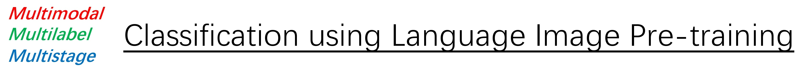
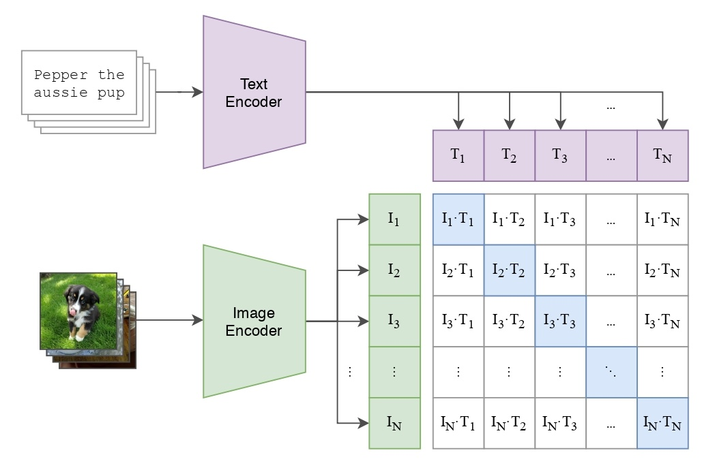
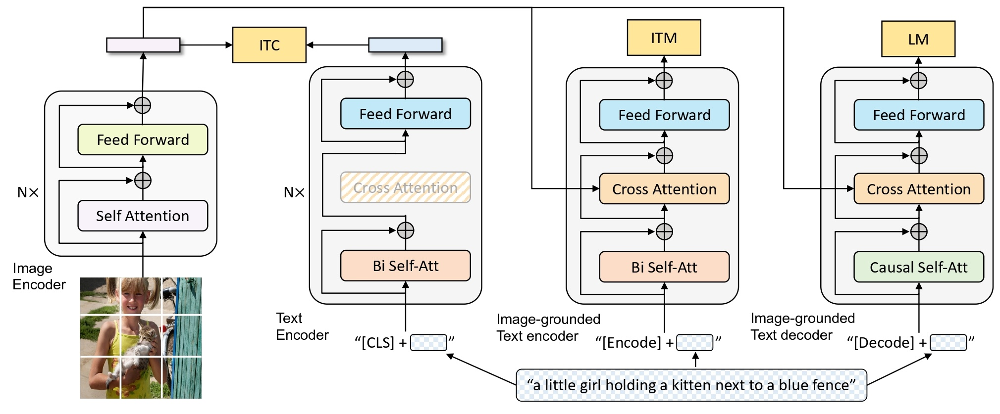

<h1><strong>MultiCLIP</strong>: Multimodal-Multilabel-Multistage Classification using Language Image Pre-training</h1>

    

        <h2>
            Motivation
        </h2>
    

    
Research into multimodalities is pivotal for advancing Artificial General Intelligence (AGI). Previous studies have delved into the capabilities of models trained using contrastive losses. Notably, successful models such as <code>CLIP</code> and <code>BLIP</code> have exerted substantial influence. However, their application predominantly focuses on tasks such as Image-Text Retrieval, Visual Question Answering, or Conditional Generation. Classification, despite being a fundamental task, has received comparatively limited attention. Thus, in this project, we demonstrate a practical implementation of a classification task using pretrained models. It is our hope that the examples provided in this repository will inspire further exploration and innovation.

    

        <h2>
            Quick Start
        </h2>
    

    

        

            <h3>
                How to Train a Model
            </h3>
        

        
To illustrate, consider training a <code>BlipMLDecoderClassifier</code> with a learning rate of 0.01. Execute the following command:

        <pre><code>python3 train.py \
        --model_name blip_ml_decoder \
        --learning_rate 1e-2</code></pre>
        
The model weights will be stored at <code>./checkpoints/blip_ml_decoder_large_bce_v1_lr0.01_bs256_seed3407_loss.pth</code>.

        
It is important to note that using a batch size of 256 with the <code>BlipMLDecoderClassifier</code> requires a GPU with at least 24 GB of memory. Additionally, our experiments were conducted on a two-GPU system, where part of the model was allocated to the second GPU. If you are operating on a machine with a single GPU, consider using alternative models such as the <code>BlipClassifier</code>, which is the default model choice.

    

    

        

            <h3>
                How to Make Predictions
            </h3>
        

        
After training your model, you can proceed to make predictions. For instance, to use the previously trained model for inference, execute the command below:

        <pre><code>python3 predict.py \
        --checkpoint_path ./checkpoints/blip_ml_decoder_large_bce_v1_lr0.01_bs256_seed3407_loss.pth</code></pre>
        
The output of the models will be saved in a <code>.csv</code> file.

    

    

        <h2>
            Dataset
        </h2>
    

  
  Links:
  <a href="https://www.kaggle.com/competitions/multi-label-classification-competition-2024/">Dataset on Kaggle</a>

 
    

        <h2>
            Backbones
        </h2>
    

Options: Base / <u>Large (Default)</u>

    
<h3>CLIP [1]</h3>

    

    
<h3>BLIP [2]</h3>

    

    

        <h2>
            <em>Multimodal</em>: Fusion Strategies
        </h2>
    

    <h3>CLIP</h3>
    <ul>
        <li>
            Router
            <ul><b>Description</b>: Utilizes a router module to dynamically assign weights to different modalities, adapting to the task requirements.</ul>
        </li>
        <li>
            <del>Boosting</del>
            <ul><b>Description</b>: Currently ineffective, this strategy requires further development and optimization.</ul>
        </li>
    </ul>
    <h3>BLIP</h3>
    <ul>
        <li>
            Naive
            <ul><b>Description</b>: The original BLIP model effectively extracts features from multiple modalities without complex modifications.</ul>
        </li>
        <li>
            Ensembling
            <ul><b>Description</b>: Combines base classifiers that use both unimodal and multimodal features to improve prediction accuracy.</ul>
        </li>
        <li>
            <del>Boosting</del>
            <ul><b>Description</b>: This strategy is still under development as it has not yet proven effective.</ul>
        </li>
        <li>
            Graph Attention Transformer (GAT)
            <ul><b>Description</b>: Employs Graph Neural Networks (GNNs) to model the relationships between labels, enhancing multilabel classification tasks.</ul>
        </li>
        <li>
            ML-Decoder [3]
            <ul><b>Description</b>: Focuses on learning robust representations by leveraging embeddings, facilitating effective decoding in complex scenarios.</ul>
        </li>
    </ul>

    

        <h2>
            <em>Multilabel</em>: Loss Functions
        </h2>
    

    <ul>
        <li><u>Binary Cross Entropy Loss with Logits (Default)</u></li>
        <li>Smoothing Loss</li>
        <li>Binary Focal Loss with Logits</li>
        <li>Angular Additive Margin (AAM) Loss with Logits [4]</li>
        <li>ZLPR Loss with Logits [5]</li>
    </ul>

    

        <h2>
            <em>Multistage</em>: Optimization
        </h2>
    

    <h3>CLIP: Unimodal Warmup</h3>
    
To optimize the effectiveness of unimodal classifiers, initial warmups are conducted until these classifiers plateau in performance improvements. Subsequently, a router is used to allocate weights to each classifier, thereby enhancing overall performance. If a unimodal classifier excels independently, it often overshadows improvements in classifiers using different modalities. Hence, unimodal warmups are essential for optimizing <code>CLIP</code>-based models.

    <h3>BLIP: Embedding Extraction</h3>
    
In scenarios with limited computational resources, it is advisable to initially extract embeddings, followed by the application of <code>MLDecoder</code> for sequential learning. This approach allows for the scaling of batch sizes to extremely large quantities, accommodating thousands of samples in a single batch.

    

        <h2>
            Project Structure
        </h2>
    

<pre>
    <code>
├── MultiCLIP/
│   ├── checkpoints/*.pth
│   ├── data/*.jpg
│   ├── figures/*.jpg
│   ├── models/*
│   ├── multi_clip/
│   │   ├── models/
│   │   │   ├── __init__.py
│   │   │   ├── blip_classifier.py
│   │   │   ├── clip_classifier.py
│   │   │   ├── config.py
│   │   │   ├── gat.py
│   │   │   ├── ml_decoder.py
│   │   │   └── router.py
│   │   ├── processors/
│   │   │   ├── __init__.py
│   │   │   ├── blip_processor.py
│   │   │   └── clip_processor.py
│   │   ├── trainers/
│   │   │   ├── __init__.py
│   │   │   ├── base_trainer.py
│   │   │   ├── boost_trainer.py
│   │   │   ├── clip_trainer.py
│   │   │   ├── head_trainer.py
│   │   │   └── ml_decoder_trainer.py
│   │   ├── utils/
│   │   │   ├── __init__.py
│   │   │   ├── inference_func.py
│   │   │   ├── label_encoder.py
│   │   │   ├── losses.py
│   │   │   ├── metrics.py
│   │   │   ├── predict_func.py
│   │   │   └── tools.py
│   │   ├── __init__.py
│   │   └── datasets.py
│   ├── .gitignore
│   ├── LICENSE
│   ├── label_encoder.npy
│   ├── predict.py
│   ├── README.md
│   ├── test.csv
│   ├── train_boost.py
│   ├── train.csv
│   └── train.py
└───
    </code>
</pre>

    

        <h2>
            Reference
        </h2>
    

<ol>
    <li>Radford, Alec, et al. "Learning transferable visual models from natural language supervision." <em>International conference on machine learning</em>. PMLR, 2021.</li>
    <li>Li, Junnan, et al. "Blip: Bootstrapping language-image pre-training for unified vision-language understanding and generation." <em>International conference on machine learning</em>. PMLR, 2022.</li>
    <li>Ridnik, Tal, et al. "Ml-decoder: Scalable and versatile classification head." <em>Proceedings of the IEEE/CVF Winter Conference on Applications of Computer Vision</em>. 2023.</li>
    <li>Deng, Jiankang, et al. "Arcface: Additive angular margin loss for deep face recognition." <em>Proceedings of the IEEE/CVF conference on computer vision and pattern recognition</em>. 2019.</li>
    <li>Su, Jianlin, et al. "Zlpr: A novel loss for multi-label classification." <em>arXiv preprint arXiv:2208.02955</em> (2022).</li>
</ol>

